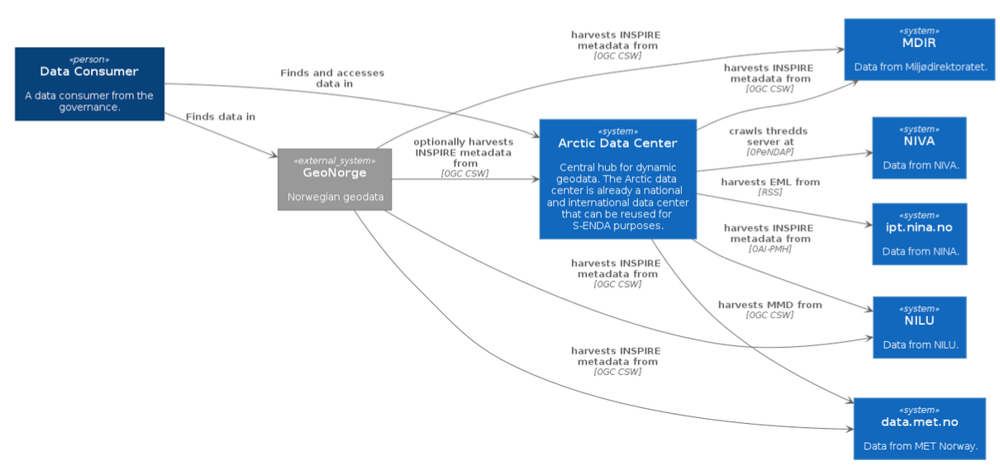

## S-ENDA Architecture

**Data storage formats and metadata specifications** 

FAIR data requires the smart use of various systems and solutions that are in continuous development. Infrastructures, systems and registers are support functions around the data sets, while fulfillment of the FAIR principles requires that the data sets are well defined and well described. Thus, it becomes important to focus on good definitions of the data sets to be made available and how data is compiled with metadata, including storage formats and information content. The aim of this chapter is to clarify this for each data set defined above.

**MET**

|Title|Granularity|Data storage format|Storage format for usage metadata|Storage format for search metadata|Storage format for provenance metadata|Visualization service|Access service|Search service|
|:----|:----|:----|:----|:----|:----|:----|:----|:----|
|Deposisjonskart for nedfall Data fra Arome-Arctic og METCOOP varslingsmodeller|<ul><li>Variables: <li>Time period per data set: Start -  Reference forecast time (00), Stop - +66 ;  <li>Geographical division/coverage: Grid over Svalbard (AA) and the Nordic region (MEPS) with 2.5km x 2.5km routes.| NetCDF-CF| NetCDF-CF | XML | XML(?) | OGC WMS |thredds.met.no| |

**NILU**

|Title|Granularity|Data storage format|Storage format for usage metadata|Storage format for search metadata|Storage format for provenance metadata|Visualization service|Access service|Search service|
|:----|:----|:----|:----|:----|:----|:----|:----|:----|
|**Deposisjonskart for nedfall av forurensning i Norge**|<ul><li>Variables: one component per dataset <li>Time period per data set: One year;  <li>Geographical division/coverage: Grid over Norway. 50x50 km, 1x1 km, 0.1x0.1 degree|NetCDF files in the THREDDS directory|CF, ACDD, EBAS|ISO19115 (OAI-PMH service)| |WMS|NetCDF file download, OPeNDAP and WM|OAI-PMH at NILU, OGC CSW and human web search interface at [adc.met.no](https://adc.met.no)|
|**Datasett til Nordatanet (Spesielt CO2 på zeppelin**)|<ul><li>Variables: Time series of measurement values  time resolution varies from an hour to a month. Some variables are multidimensional <li>Time period per data set Variable: 1 year to several decades <li>Geographical division/coverage: One measurement point per data set |NetCDF files in the THREDDS directory|CF, ACDD, EBAS|ISO19115 (OAI-PMH service)| | |NetCDF file download and OPeNDAP [thredds.nilu.no](https://thredds.nilu.no/thredds/catalog/ebas/catalog.html)|<li>OAI-PMH at NILU [ebas-oai-pmh.nilu.no/oai/](https://ebas-oai-pmh.nilu.no/oai/) <li>OGC CSW and human web search interface at [adc.met.no](https://adc.met.no)|

**NIVA**

|Title|Granularity|Data storage format|Storage format for usage metadata|Storage format for search metadata|Storage format for provenance metadata|Visualization service|Access service|Search service|
|:----|:----|:----|:----|:----|:----|:----|:----|:----|
|**Kart for overskridelser av tålegrenser for nedfall av forurensning i Norge**| <ul><li>Variables: sswc,fab ; <li>Time period per data set: Start: 2017, End: 2021 ;  <li>Geographical division/coverage: |NetCDF|CF-NETCDF|ACDD| | |[thredds.t.niva.no](https://thredds.t.niva.no/thredds/dodsC/datasets/exceedance-limits/fab-sswc-veg-exceedence/2017-2021_acdd_fab-sswc-veg-exceedence.nc.html)  (_log in required_)| [adc.met.no](https://adc.met.no)
|**SIOS sensor buoy in Adventfjorden**|<ul><li>Variables: temperature, conductivity, salinity, turbidity, fDOM, chlorophyll, oxygen and light backscattering; <li> Time period per data set: <li>graphical division/coverage: point|NetCDF|CF-NETCDF|ACDD xml/NetCDF| | |[thredds.t.niva.no](thredds.t.niva.no)|Machine search service: ogc csw through [adc.met.no](https://adc.met.no) |; Human search service: [adc.met.no](https://adc.met.no)
|**MULTISOURCE/DigiVEIVANN**|<ul><li>Variables:(temperature for inlet), turbidity, water level, conductivity; <li> Time period per data set: 24 hours duration <li> Aggregate dataset: Start - 2022-09-14T11:14:59; End - no time_coverage_end (continuously adding new data)<li>graphical division/coverage: point (two datasets: inlet and outlet at a location in Oslo)|NetCDF|CF-NETCDF|ACDD xml/NetCDF| | |[thredds.t.niva.no](thredds.t.niva.no)|Machine search service: ogc csw through [adc.met.no](https://adc.met.no), Human search service: [adc.met.no](https://adc.met.no)|

**NINA**

|Title|Granularity|Data storage format|Storage format for usage metadata|Storage format for search metadata|Storage format for provenance metadata|Visualization service|Access service|Search service|Landing page|
|:----|:----|:----|:----|:----|:----|:----|:----|:----|:----|
|**Norwegian breeding bird monitoring scheme**| <ul><li>Variables: Number of observed pairs ; <li>Time period per data set: Start: 2006, End: - ;  <li>Geographical division/coverage: Location accumulated to one common point per assessment route |DarwinCore Archive||Norwegian INSPIRE xml| | |[ipt.nina.no](https://ipt.nina.no/)| 
|**InsectDB**|<ul><li>Variables: <li> Time period per data set: Start: 1821, End: - ;  <li>graphical division/coverage: points|DarwinCore Archive||Norwegian INSPIRE xml| | | [ipt.nina.no](https://ipt.nina.no/)| [NINA insect database](https://ipt.nina.no/resource?r=insectdb) |
|**Skandobs**|<ul><li>Variables: <li> Time period per data set: Start: 2001, End: - ;  <li>graphical division/coverage: points|DarwinCore Archive||Norwegian INSPIRE xml| OGC CSW | | ||

